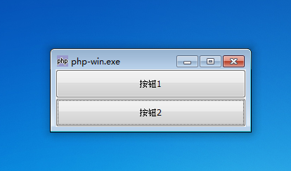
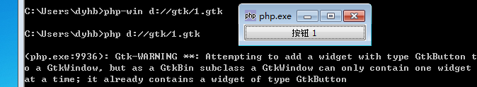

GtkWindow就像是一个包含应用程序其它部分的一个窗口。它为其它应用提供了一个空间，它们一起组成一个完整的应用程序。GtkWindow是GtkBin的一个子类，它只能容纳一个元件。为了能够添加更多元件，你可以给GtkWindow添加一个可以容纳多个元件的子容器（比如：GtkHBox或则GtkVBox）。这样就能够将其它元件添加至这些子容器中。因为，当你试图向GtkWindow添加多个元件是会引起系统警告。

GtkWindow类的构造函数为GtkWindow ([ GtkWindowType type = Gtk::WINDOW_TOPLEVEL ])，构造函数的作用是创建一个GtkWindow的实例。如果没有指定类型，这个时候会创建一个 Gtk::WINDOW_TOPLEVEL类型的窗口，这种类型的窗口包含边框和标题栏。两个GtkWindow窗口类型为Gtk::WINDOW_POPUP没有标题栏和边框，这种类型的窗口通常用于一些工具条提示和菜单。

# 例 1. Gtk::WINDOW_TOPLEVEL 类型GtkWindow使用实例
~~~
<?php   
if(!class_exists('gtk')){   
	die("php-gtk2 模块未安装\r\n");   
}   
    
  
$window = new GtkWindow();   
  
$button1 = new GtkButton();   
$button1->set_label('按钮1');   
$button2= new GtkButton();   
$button2->set_label('按钮2');   
  
$vBox = new GtkVBox();   
$vBox->add($button1);   
$vBox->add($button2);   
  
$window->add($vBox);   
$window->show_all();   
  
// 开始主循环   
Gtk::main();
?>  
~~~
程序运行效果如下：

# 例 2. Gtk::WINDOW_POPUP 类型GtkWindow使用实例
~~~
<?php   
if(!class_exists('gtk')){   
	die("php-gtk2 模块未安装\r\n");   
}   
  
$window = new GtkWindow(Gtk::WINDOW_POPUP);   
$window->set_position(Gtk::WIN_POS_CENTER_ALWAYS);   
  
$label1=new GtkLabel();   
$label1->set_label("欢迎光临 PHP-GTK!");   
$label1->set_alignment(0.5, 0.5);   
$label1->set_padding(20,20);   
$label1->set_visible(true, false);   
  
$window->add($label1);   
$window->show_all();   
  
// 开始主循环   
Gtk::main();   
?> 
~~~ 

程序运行效果如下：

# 例3：GtkWindow 加载多个元件抛出警告
~~~
<?php   
if(!class_exists('gtk')){   
	die("php-gtk2 模块未安装\r\n");   
}   
  
$window = new GtkWindow();   
  
$window->add(new GtkButton('按钮 1'));   
$window->add(new GtkButton('按钮 2'));   
  
$window->show_all();   
  
// 开始主循环   
Gtk::main();   
?>  
~~~
程序运行效果如下：

关于GtkWindow中我们就介绍到这里了，GtkWindow中有很多属性来约束窗口，GtkWindow也有很多方法，通过这些方法可以动态改变窗口外观和返回窗口一些信息。

这些所有的大家可以通过PHP-GTK 2的技术文档了解细节问题。