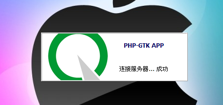
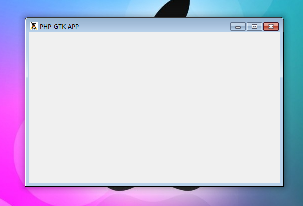

到目前为止，你已经看到了几个简单的应用程序的例子，但还因为，我们还没有真正讨论了如何用代码组成能够工作的PHP-GTK应用程序。仔细检查到目前为止所显示的代码显示在屏幕上创建的窗口的所有代码有几个共同行的代码：show_all，main和main_quit方法。这几行对任何工作的PHP-GTK的应用至关重要，因为它们负责启动和关闭应用程序。

正如你已经了解到，show_all在屏幕上显示主窗口，也显示容乃在窗口中的元件。mian和main_quit的方法是可以说是PHP-GTK中的两个最重要的方法，我们将介绍它们在这里。

# 开始循环

创建的应用程序使用PHP-GTK是能够不断地对用户事件作出响应，因为它在连续循环中运行。每一个几分之一秒，PHP-GTK将会检查，是否有任何事件发生，发出任何所需的信号，并调用任何需要的回调方法。它这样做只要应用程序反复运行。这样反复的动作是使PHP-GTK的它所做的工作方式。

到目前为止，你见过几个例子，包括调用Gtk::main，这将启动Gtk的循环。这是一个开始监听事件和调用回调的过程。

GTK的循环，是PHP的任何其它的循环类似，但它确实有一些根本性的不同之处。例如，在一个脚本，出现后调用Gtk::main后面的代码将不会被执行，直到循环结束。这是人们所期望从一个for或者一个while循环的效果。然而，不像典型的循环结构，在循环过程中发生什么可以大幅度改变。循环具有互动性，这取决于什么事件发生，一次迭代可能紧缩数字集，而第二次可能会做什么都没有做。执行程序可能需要每次迭代过程中完全不同的道路，但最终，执行总是回到循环。

循环将继续下去，直到应用程序退出循环。退出循环是通过调用Gtk::main_quit方法来自动实现。Gtk:: main_quit发出一种内部信号，它告诉PHP-GTK的是时间停止连续循环。当退出循环，执行后面的脚本。

在大多数面向对象的应用程序中，调用的Gtk::main是包裹在一个类调用的方法start或者类似的东西。这样做可以让应用程序的最后一个机会执行任何代码或者在循环开始之前检查一些值。

不管Gtk::main如何调用，有一件重要的关于每一个应用的事情要记住：在Gtk::main被调用前，应用程序的主窗口应该至少show，如果没有使用show_all。请记住，Gtk::main开始GTK的主循环。循环使该应用程序是交互式的，但如果代码没有显示窗口，这个时候就没有办法让用户与应用程序交互。由于该程序是在一个循环中执行，程序不能进去做任何改变。因此，如果窗口不显示循环前启动时，应用程序将被卡住。
 
# 结束循环

停止循环是调用Gtk:: main_quit是一件简单的事情，但决定如何调用它是不是很简单。虽然调用的Gtk::main是通常是脚本运行时，调用退出循环通常是在用户对事件的响应。自动关闭应用的想法可能不是最好的主意，因此大多数应用程序通常等待用户关闭窗口或者从菜单中选择退出选项。

由于关闭一个应用程序通常是由用户触发，Gtk::main_quit通常作为一个顶层窗口的destroy信号的回调。查看到目前为止的几乎所有的代码。它们每个几乎在其中包含以下行（类似的行）：
~~~
$this->connect_simple('destroy',  array('Gtk','main_quit'));  
~~~

该行表示，当主应用程序被破坏，应该退出循环。这种方法简单地杀死循环。没有检查运行，以验证用户是否想要关闭应用程序或者给他们最后一个机会，以保存它们的工作。对于最简单的应用程序，这可能是足够了。其它可能需要包装在另一种方法里面调用Gtk::main_quit或者为destroy信号创建两个信号处理，在前面的章节中你应该已经看到了。

调用Gtk::main_quit，最后的元件被销毁是必不可少的。如果所有的元件在循环退出之前被销毁了，将没有办法从内部调用Gtk::main_quit退出循环。正如你看到的Gtk::main，如果你是主循环之外，你不能与它进行交互。如果没有与循环交互的方法，那么就没有办法阻止它。如果不能停止循环，脚本不能继续。如果主循环停止之前，所有的元件都被摧毁，这将是由脚本调用Gtk::main以清理其它元件。

创建一个信号句柄来调用的Gtk::main_quit或者包含该方法才是真正的终止GTK循环的最佳做法。

# 穿过循环的步骤

GTK的循环可以嵌套，这意味着一个循环可能启动另一个。对于每个调用Gtk::main，必须有一个调用Gtk::main_quit。每个调用的Gtk::main_quit退出一层循环。说实话，我还没有遇到需要嵌套循环的情况下，但它们是可能的。更可能是只有一个循环迭代应执行的机会。

这是很有效的，运行一个循环迭代来更新的应用程序的GUI。这可能是做更新进度条，比如在一个长期的过程，如通过FTP上传一个文件。执行只有一个循环迭代，使用Gtk::main_iteration方法。我们已经在本章的发展闪屏可以通过循环步骤来加强效果。每次一些应用程序的安装启动或者完成，例如连接到数据库，闪屏可以更新，使用户通过闪屏知道究竟发生了什么。不幸的是，Gtk::main_iteration不自己做这些方法。它需要从另一种方法叫做Gtk::events_pending那里获得帮助。

Gtk::events_pending方法告诉PHP-GTK，如果需要处理任何事件在循环的最后一次迭代已经发生。当Gtk::events_pending和Gtk::main_iteration一起在一个while循环中使用，GUI将随着事情的发生随时更新，如标签的值被改变。如果随着GTK的循环迭代的推移，没有什么重大的事情发生，while循环将被终止。

下面的代码是一个结合前两次的代码。这个例子让启动画面工作。首先，创建和显示启动画面。当启动屏幕实例，我们创建了一个信号句柄将调用startMainWindow方法，当启动画面显示时。由于show信号不能发射，直到GTK的主循环启动时，该信号句柄基本上是开始一个方法调用的方式，以便它和循环开始时同时执行。这是一种在循环开始之前欺骗和参与循环的方法。当被调用时，startMainWindow方法将实例化一个的Crisscott_MainWindow的实例，并调用几个设置方法。在每个方法之间，设置了一个新的状态消息和通过调用GTK:: main_iteration让GUI更新。简单的while循环找到每一个Gtk::main_iteration调用来检查在需要处理的最后迭代中是否有事件已经发生。

使用Gtk::main_iteration更新GUI：
~~~
<?php   
if(!class_exists('gtk')){   
    die("php-gtk2 模块未安装 \r\n"); 
}   
  
class Crisscott_SplashScreen extends GtkWindow{   
    public $status;   
  
    public function __construct(){   
        parent::__construct();   
        $this->set_decorated(false);   
  
        $style=$this->style->copy();   
        $style->bg[Gtk::STATE_NORMAL]=$style->white;   
        $this->set_style($style);   
  
        $this->set_size_request(300,100);   
  
        $this->set_position(Gtk::WIN_POS_CENTER);   
        @$this->set_keep_above(true);// 有警告   
        $this->_populate();   
        $this->connect_simple('destroy',array('Gtk','main_quit'));   
    }   
  
    private function _populate(){   
        $frame=new GtkFrame();   
        $hBox=new GtkHBox();   
        $vBox=new GtkVBox();   
  
        $frame->set_shadow_type(Gtk::SHADOW_ETCHED_OUT);   
        $titleText='<b>PHP-GTK APP</b>';   
        $title=new GtkLabel($titleText);   
        $title->set_use_markup(true);   
  
        $this->status=new  GtkLabel('加载中...');   
        $vBox->pack_start($title,true,true,10);   
        $vBox->pack_start($this->status,true,true,10);   
        $logoImg=GtkImage::new_from_file('window.png');   
        $hBox->pack_start($logoImg,false,false,10);   
        $hBox->pack_start($vBox,false,false,10);   
        $frame->add($hBox);   
        $this->add($frame);   
    }   
       
    public function start(){   
        $this->show_all();   
        $this->startMainWindow();   
        Gtk::main();   
    }   
  
    public function startMainWindow(){   
        $main=new Crisscott_MainWindow();   
  
        while(Gtk::events_pending()){ Gtk::main_iteration(); }   
        $this->status->set_text('连接服务器中...');   
  
        while(Gtk::events_pending()){ Gtk::main_iteration(); }   
        sleep(3);   
        if($main->connectToServer()){ // 尝试连接服务器   
            $this->status->set_text('连接服务器... 成功');   
        }else{   
            $this->status->set_text('连接服务器... 失败');   
        }   
  
        while(Gtk::events_pending()){ Gtk::main_iteration(); }   
        sleep(5);   
        $this->status->set_text('连接本地数据库...');   
  
        while(Gtk::events_pending()){ Gtk::main_iteration(); }   
        sleep(3);   
        if($main->connectToLocalDB()){// 尝试连接本地数据库   
            $this->status->set_text('连接本地数据库...  成功');   
        }else{   
            $this->status->set_text('连接本地数据库...  失败');   
            while(Gtk::events_pending()){ Gtk::main_iteration(); }   
            sleep(3);   
            $this->status->set_text('尝试从新连接本地数据库...');   
            while(Gtk::events_pending()){ Gtk::main_iteration(); }   
            sleep(3);   
            $this->status->set_text('从新连接本地数据库...成功');   
        }   
  
        while(Gtk::events_pending()){ Gtk::main_iteration(); }   
        sleep(3);   
        $main->show_all();   
        while(Gtk::events_pending()){ Gtk::main_iteration(); }   
        $this->hide();   
    }   
}   
  
class Crisscott_MainWindow extends GtkWindow{   
  
    public function __construct(){   
        parent::__construct();   
        $this->set_size_request(500,300);   
        $this->set_position(Gtk::WIN_POS_CENTER);   
        $this->set_title('PHP-GTK APP');   
        $this->maximize();   
        $this->connect_simple('destroy',array('Gtk','main_quit'));   
    }   
  
    public function connectToServer(){   
        return true;   
    }   
  
    public function connectToLocalDB(){   
        return false;   
    }   
}   
  
// 运行程序   
$splash=new Crisscott_SplashScreen();   
$splash->start();   
  
?>  
~~~

程序运行效果如下：

现在，这两个窗口合并成一个应用程序，你会得到一个更完整的视觉关于闪屏如何工作的。从用户的角度来看，上述代码被执行，闪屏出现，出现一些消息动画，加载主应用程序，然后闪屏消失。sleep的调用只是暂时的，并给予一个更确切的用户体验。这种方法是远远超过刚刚加载的应用程序但不通知用户的正在发生什么事情的用户体验。

# 更多信息
我们将采取行动更新这两个类变得更好，但对于现在而言，这些应该足够了。
更好地学习请阅读《Pro.PHP.GTK》这本书，这是一本讲述如何用 PHP-GTK 开发项目的书籍。