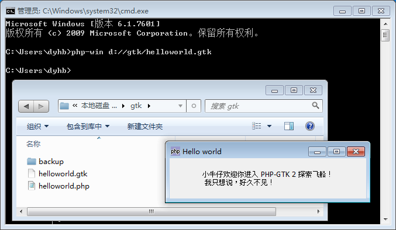

PHP-GTK 目前的版本为 2.0.1.0，PHP 支持的最新版本为 5.5，GTK+ 版本为 2.24.10，文档以最新的为参考，教程在 Win7下面调试。

#1）PHP-GTK 2 下载    

PHP-GTK 最新版本可以从官网网站下载：
http://gtk.php.net/download.php?language=en-US

这里我们以 PHP55 这个版本做的中文教程。
http://gtk.php.net/distributions/PHP55-GTK2.zip

#2）设置环境变量    

### （1）解压到 C 盘
将下载的文件解压到 C 盘，这里我们为 C:\php-gtk\PHP55-GTK2

### （2）设置系统环境变量
打开 “计算机/系统属性/高级/环境变量”，修改“系统变量”中的 “Path ”添加一个 “;C:\php-gtk\PHP55-GTK2”

查看是否成功，我们在 D:/gtk 建立一个 helloworld.php 测试一下。
~~~
<?php
echo 'Hello world !';
?>
~~~

如果运行成功，表示正常，运行可能会报错，我这里修改了php.ini里面解决了。

修改 C:\php-gtk\PHP55-GTK2\php.ini 里面，将这两个扩展都注释了，如果你的系统无法加载扩展就依次都注释掉 ; 
> ;extension=php_interbase.dll
> ;extension=php_pdo_firebird.dll 

将编码改为 utf-8，不然 PHP-GTK 界面中文乱码。

> ;php-gtk.codepage = CP1250
> ;php-gtk.codepage = ISO-8859-1
> php-gtk.codepage = UTF-8

### （3）写第一个 PHP-GTK Hello World 程序
建立一个 helloworld.gtk 的文件，后缀名可以随意，但是为了和其它 PHP 文件区分，我建议是 .gtk 扩展名比较给力。

命令行打开界面非常不友好，我们可以在 windows 直接指定用 php-win.exe (C:\php-gtk\PHP55-GTK2\php-win.ext)。
右键 helloworld.gtk，打开提示从安装程序中选中 php-win.ext 即可。

选择浏览，打开 PHP5-GTK2 的目录，直接选中 php-win.exe

现在就可以直接双击打开 helloworld.gtk 了，试试吧，好了 PHP-GTK 的安装就结束了。