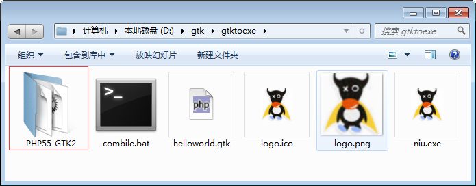
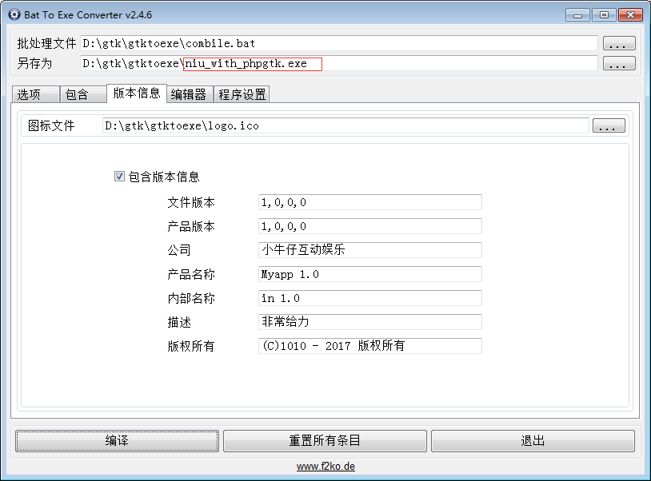
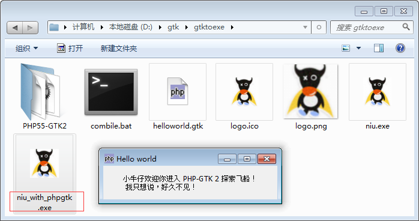
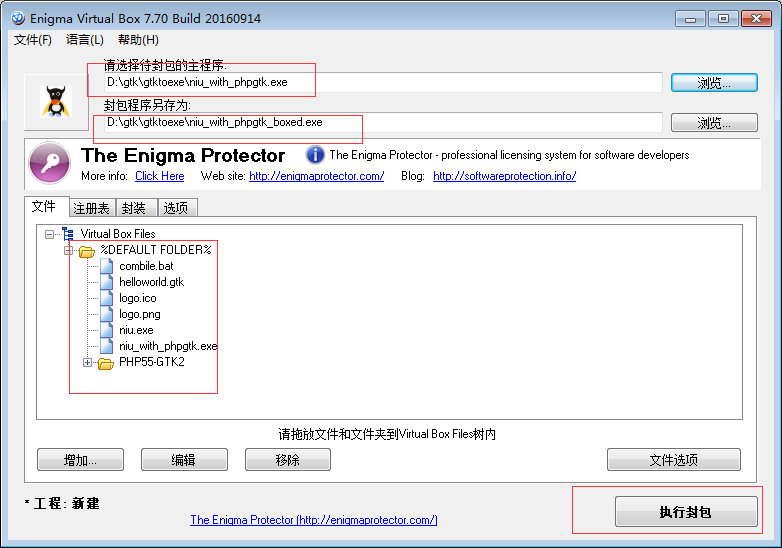
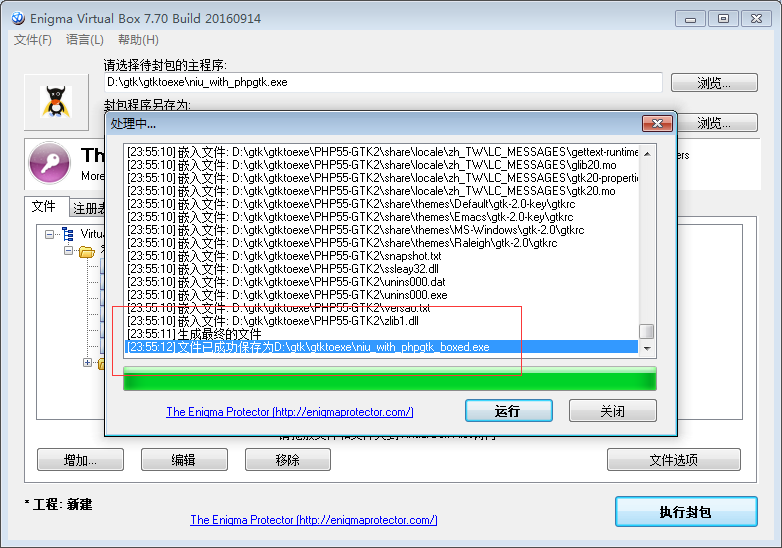
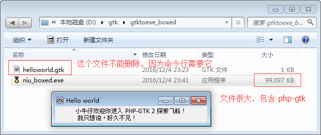

如果你觉得设置环境变量太麻烦了，还可以直接把 PHP-GTK 2 桌面运行环境拷贝过来，命令行指定运行文件即可。

# 1）复制一份 PHP-GTK 2 的运行环境

将 C:\php-gtk\PHP55-GTK2 复制一份到 D:\gtk\gtktoexe\PHP55-GTK2 中，我们将使用当前目录下面的 php-win.exe 解析 .gtk。

# 2）修改命令行的路径
其中 %cd% 表示当前目录，所以这里就可以访问到当前目录下面的 PHP-GTK 2运行环境，而不是 C 盘下面的。
~~~
@echo off

if "%b2eprogramfilename%"==""  (
	echo 想要查看结果请使用 BatToExeConverter 软件打包
	pause
	goto :eof

)

%cd%\PHP55-GTK2\php-win.exe helloworld.gtk
~~~

# 3）运行 niu_with_phpgtk.exe 即可
这个的好处就是不用设置环境变量，但是文件必须包含 PHP-GTK 2，删除将无法运行。

# 4）php-gtk 文件太多，压缩到一个 exe 文件
单文件制作封装工具(Enigma Virtual Box)V7.70中文版，将大量的小文件封装起来。
http://www.pc6.com/softview/SoftView_65046.html#download

下载完成，安装，打包

打包执行成功，拷贝 helloworld.gtk 到生成的目录，其它的不要

点击运行即可
