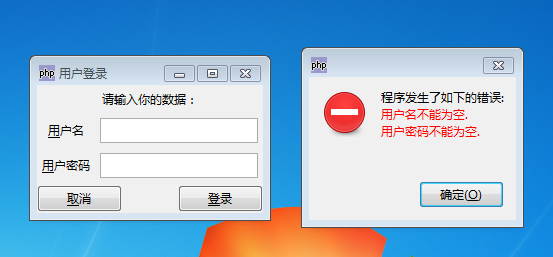

本指南比第一个 hello world 指南介绍了更加高级的功能。 这里，我们创建一个用户可以输入用户名和密码的登录窗口。 用户点击登录按钮时，检查文本框内容，当用户忘记他的用户名或密码时显示错误的消息。

这里有一个截屏，显示了程序完成以后的样子：

首先，创建一个窗口，设置它的标题并且设置当窗口销毁时退出主循环—— 这些你应当已经在上一节中有所了解：
~~~
$wnd = new GtkWindow();   
$wnd->set_title('用户登录');   
$wnd->connect_simple('destroy', array('gtk', 'main_quit'));  
~~~

下一个任务是创建对话框上需要的所有元件。首先，输入用户名和密码的两个文本框：
~~~
$txtUsername = new GtkEntry();   
$txtPassword = new GtkEntry();  
~~~

我们希望用户明白哪个文本框输入用户名，哪个文本框输入密码，所以还需要标签用于描述：
~~~
// 第二个参数表明下划线应当转化为助记符下划线   
$lblUsername = new GtkLabel('_用户名',true);   
$lblPassword = new GtkLabel('_用户密码',true);  
~~~

最后，我们需要两个按钮：一个用来登录，另一个用来取消进程：
~~~
$btnLogin = new GtkButton('_登录');   
$btnCancel = new GtkButton('_取消');  
~~~
你可能注意到 GtkLabel 传递的第二个参数， 这表明下划线的作用是其后的字符显示下划线，而 GtkButton 的构造函数并没有这个参数：按钮的构造函数自动完成助记符的转换， 而标签的并不是这样。这个行为可能对你来说有点奇怪 ，但是大概原因是按钮标签上的助记符比普通标签上的更加常用。

现在标签需要知道当助记符激活时哪个元件被激活。由下面的方法实现：
~~~
$lblUsername->set_mnemonic_widget($txtUsername);   
$lblPassword->set_mnemonic_widget($txtPassword);  
~~~

更进一步，我们需要判断当按钮按下时调用哪个操作。 取消按钮将会销毁窗口（这将中止应用程序） 而登录按钮将检查文本框并调用进一步的操作：
~~~
$btnCancel->connect_simple('clicked', array($wnd, 'destroy'));   
$btnLogin ->connect_simple('clicked', 'login', $wnd, $txtUsername, $txtPassword);  
~~~

我们向（还未经定义的）login 函数传递了作为可选参数的三个元件 $wnd，$txtUsername 和 $txtPassword，因为我们需要：获取文本框的值， 同时如果一切正常则销毁或隐藏窗口。

现在我们已经有了全部需要的元件，并添加到了窗口上。由于 GtkWindow 是二进制容器，它仅仅可容纳一个元件。 所以我们需要一个可以容纳许多元件并可很好的对元件进行布局的容器。 GtkTable 是一个不错的选择，因为它可以保持标签在一列， 同时文本框在下一列：
~~~
$tbl = new GtkTable(3, 2);   
$tbl->attach($lblCredit, 0, 2, 0, 1);   
$tbl->attach($lblUsername, 0, 1, 1, 2);   
$tbl->attach($txtUsername, 1, 2, 1, 2);   
$tbl->attach($lblPassword, 0, 1, 2, 3);   
$tbl->attach($txtPassword, 1, 2, 2, 3);  
~~~
($lblCredit 是仅仅有一条信息的标签。). 按钮有它们自己的 GtkHButtonBox， 因为这个类可以将许多按钮排列得非常好：
~~~
$bbox = new GtkHButtonBox();   
$bbox->set_layout(Gtk::BUTTONBOX_EDGE);   
$bbox->add($btnCancel);   
$bbox->add($btnLogin);  
~~~

布局的最后工作是在窗口上添加 table 和 button box。这是无法直接完成的， 因为 GtkWindow 继承于 GtkBin 而只能保持一个元件。所以我们需要另外的容器，这回使用 GtkVBox：
~~~
$vbox = new GtkVBox();   
$vbox->pack_start($tbl);   
$vbox->pack_start($bbox);  
~~~

全部就这么多，我们可以显示窗口了：
~~~
$wnd->add($vbox);   
$wnd->show_all();   
Gtk::main();  
~~~
最后还未完成的是 login 函数，当用户点击登录按钮时调用。 它将检查用户名和密码的值：如果它们的长度是 0（用户没有输入任何内容）， 一个错误信息将会显示。如果一切正常，窗口将销毁同时程序继续执行并显示主窗口。

从元件获取文本是非常简单的，我们仅仅需要使用 GtkEntry 的 get_text() 方法：
~~~
$strUsername = $txtUsername->get_text();   
$strPassword = $txtPassword->get_text();  
~~~

使用普通的 php 函数 strlen 完成检查。 如果出现错误，我们希望显示一个有一条消息的对话框。 GtkMessageDialog 用于这个任务， 它自动创建了图标和按钮（OK, Yes/No）：
~~~
$dialog = new GtkMessageDialog($wnd, Gtk::DIALOG_MODAL, Gtk::MESSAGE_ERROR, Gtk::BUTTONS_OK, $errors);   
$dialog->set_markup("程序发生了如下的错误:\r\n" . $errors . "");   
$dialog->run();   
$dialog->destroy();  
~~~
现在你只要确保已经将 login 函数放在了主循环的“前面”，那么运行它。

程序全部代码如下：
~~~
<?php   
if(!class_exists('gtk')){   
    die("php-gtk2 模块未安装\r\n");   
}   
  
function login(GtkWindow $wnd, GtkEntry $txtUsername, GtkEntry $txtPassword){   
    // 获取登录数据   
    $strUsername = $txtUsername->get_text();   
    $strPassword = $txtPassword->get_text();   
  
    // 数据验证   
    $errors = null;   
    if (strlen($strUsername) == 0) {   
        $errors .= "用户名不能为空.\r\n";   
    }   
    if (strlen($strPassword) == 0) {   
        $errors .= "用户密码不能为空.\r\n";   
    }   
  
    if ($errors !== null) {   
        // 使用对话框输出错误消息   
        $dialog = new GtkMessageDialog($wnd, Gtk::DIALOG_MODAL,   
            Gtk::MESSAGE_ERROR, Gtk::BUTTONS_OK, $errors);   
        $dialog->set_markup(   
            "程序发生了如下的错误:\r\n"  
            . "" . $errors . ""  
        );   
        $dialog->run();   
        $dialog->destroy();   
    } else {   
        // 销毁窗口   
        $wnd->destroy();   
    }   
}   
  
// 创建登录窗口   
$wnd = new GtkWindow();   
$wnd->set_title('用户登录');   
$wnd->connect_simple('destroy', array('gtk', 'main_quit'));   
  
// 创建所有挂件   
$lblCredit = new GtkLabel('请输入你的数据：');   
$lblUsername = new GtkLabel('_用户名', true);   
$lblPassword = new GtkLabel('_用户密码', true);   
$txtUsername = new GtkEntry();   
$txtPassword = new GtkEntry();   
$btnLogin = new GtkButton('_登录');// 按钮   
$btnCancel = new GtkButton('_取消');   
  
// 记符激活时哪个元件被激活   
$lblUsername->set_mnemonic_widget($txtUsername);   
$lblPassword->set_mnemonic_widget($txtPassword);   
//$txtPassword->set_invisible_char('*');   
  
// 登录按钮   
$btnCancel->connect_simple('clicked', array($wnd, 'destroy'));   
$btnLogin->connect_simple('clicked', 'login', $wnd, $txtUsername, $txtPassword);   
  
// GtkTable布局   
$tbl = new GtkTable(3, 2);   
$tbl->attach($lblCredit, 0, 2, 0, 1);   
$tbl->attach($lblUsername, 0, 1, 1, 2);   
$tbl->attach($txtUsername, 1, 2, 1, 2);   
$tbl->attach($lblPassword, 0, 1, 2, 3);   
$tbl->attach($txtPassword, 1, 2, 2, 3);   
  
// GtkHbuttonBox容器   
$bbox = new GtkHButtonBox();   
$bbox->set_layout(Gtk::BUTTONBOX_EDGE);   
$bbox->add($btnCancel);   
$bbox->add($btnLogin);   
  
// GtkVBox布局   
$vbox = new GtkVBox();   
$vbox->pack_start($tbl);   
$vbox->pack_start($bbox);   
  
// 添加至窗口   
$wnd->add($vbox);   
$wnd->show_all();   
Gtk::main();   
?>
~~~

