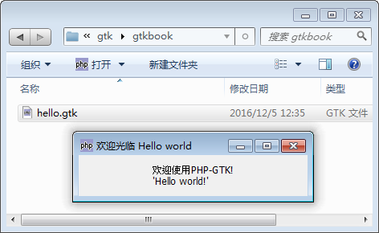

当你开始学习一门编程语言，通常你的第一个程序都是编写“hello world”。 所以，为了符合这个通常的习惯，本手册中的第一个指南也就从“hello world” 指南开始！

我们希望在通篇指南中紧扣 PHP 本身。指南被设计为提供用户如何使用 PHP-GTK， 以及这其中的思想和技术。在这个指南中我们将创建一个简单的窗口，并有“Hello World!”的文本在上面。我们将从列出的程序开始逐行解释，这会提供一个基本的 PHP-GTK 应用的概况。

# 1): 简单的 Hello World 脚本
~~~
<?php   
if(!class_exists('gtk')){   
    die("php-gtk2 模块未安装 \r\n");   
}   
  
$wnd=new GtkWindow();   
$wnd->set_title('欢迎光临 Hello world');   
$wnd->connect_simple('destroy',array('gtk', 'main_quit'));   
  
$lblHello=new GtkLabel("欢迎使用PHP-GTK!\r\n'Hello world!'");   
$wnd->add($lblHello);   
  
$wnd->show_all();   
Gtk::main();   
?>  
~~~
复制代码到文本编辑器中并保存为 hello.gtk，编码请设置为utf-8，否则中文会乱码，你会发现 .gtk 的文件是可以双击的。 然后双击 hello.gtk。 一个标题为“欢迎光临 Hello world”的窗口应当显示出来， 除了文本“欢迎使用PHP-GTK! 'Hello world!'”上面没有任何内容，如图。

# 2): 检查 PHP-GTK 是否可用
~~~
if(!class_exists('gtk')){   
    die("php-gtk2 模块未安装 \r\n");   
}  
~~~
这里通过检查类 gtk 是否存在来确定 PHP-GTK 是否可用。 我们能做的就是输出一个消息，告诉用户模块不可用并且需要进一步设置可用。

# 3): 创建窗口
~~~
$wnd=new GtkWindow();  
~~~
建新窗口元件对象就像创建新对象一样简单： 赋值新的对象到变量 $wnd。

# 4): 设置窗口标题
~~~
$wnd->set_title('欢迎光临 Hello world');  
~~~
为了让窗口在任务栏中便于识别，我们设置窗口标题：仅仅是调用了对象的方法。

# 5): 设置窗口标题
~~~
$wnd->connect_simple('destroy', array('gtk', 'main_quit')); 
~~~
这是代码中第一处有趣的部分："destroy" 信号连接到静态方法 Gtk::main_quit。 它简单的告诉 GTK 当窗口关闭或销毁时退出主循环。（关于主循环将在下面的部分解释）

# 6): 创建一个用于显示文本的标签
~~~
$lblHello=new GtkLabel("欢迎使用PHP-GTK!\r\n'Hello world!'");  
~~~
像之前一样，我们创建了一个新的元件。这次我们希望显示一小段文字，而 GtkLabel 非常适合这个任务。

# 7): 在窗口上添加标
~~~
$wnd->add($lblHello);  
~~~
现在我们告诉窗口，标签将会添加在上面。

# 8): 显示窗口
~~~
$wnd->show_all();  
~~~
到现在为止，你的屏幕上还什么都没有。为了显示窗口，你需要调用 show() 。这可以显示窗口，但不包含标签—— 我们不得不对标签也调用 show() 。 如果你在窗口上有多个元件如按钮、选择框或者其他这是很不方便的： show_all() 会帮助显示窗口以及所有的子元件。

# 9): 开始主循环
~~~
Gtk::main();
~~~
在所有都设置好了以后，我们需要确保窗口保持开启并相应用户交互。 一个普通的 PHP 脚本会中指并退出，但是我们希望它继续执行：为了这个目的， GTK 主循环被调用。用于程序保持运行并等待用户事件。 如果事件发生，它将其委派到相应的回调函数中去

# 进一步阅读
现在你已经创建了你的第一个 PHP-GTK 2 应用，你可能希望创建更加复杂的布局。 阅读 PHP-GTK 2.0参考指南 了解基础的方法。
> 注意：上面的文章来自于PHP-GTK 2英文手册，我们这里做了一点修改和翻译。

