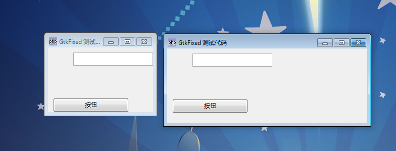

GtkFixed 这个容器没有自己的布局逻辑；你必须指定元件摆放的位置。 元件的尺寸是自动设定的，但是你可以通过 set_size_request() 重新设置一个尺寸。

当然摆放固定位置的元件是非常简单的：调整窗口大小不会移动元件或调整其尺寸。 只有当绝对必要的时候才使用它；多数情况下动态容器是更好的选择。 

# 例 1. 使用 GtkFixed 实现固定布局
~~~
<?php   
if(!class_exists('gtk')){   
    die("php-gtk2 模块未安装 \r\n");   
}   
  
$w = new GtkWindow();   
$w->set_title('GtkFixed 测试代码');   
$w->connect_simple('destroy', array('gtk', 'main_quit'));   
  
$btn = new GtkButton('按钮');   
$txt = new GtkEntry();   
  
$fixed = new GtkFixed();   
$w->add($fixed);   
  
$fixed->put($btn, 10, 100);   
$fixed->put($txt, 50, 10);   
$btn->set_size_request(150, -1);   
  
$w->show_all();   
Gtk::main();   
?>
~~~

效果如下：

