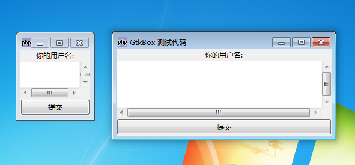
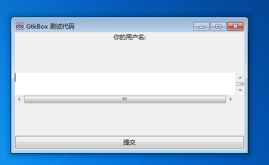

最简单但也是最常用的容器是 GtkBox 特别是： GtkHBox 和 GtkVBox。 它们允许在一行中添加元件，不多也不少。GtkHBox 水平摆放元件，而 GtkVBox 则垂直摆放它们。

使用 pack_start() 或 pack_end() 添加元件。 pack_start() 会从开始添加， 将一个元件放到另一个的后面（从左到右，从上到下）， 而 pack_end() 则从末尾添加（从右到左，从下到上）。

你可以通过 pack_start() 和 pack_end() 的三个可选的参数来调整布局。 详细情况请看它们的文档。

# 例 1，使用 GtkVBox 简单实现动态布局
~~~
<?php   
if(!class_exists('gtk')){   
    die("php-gtk2 模块未安装 \r\n");   
}   
  
$w = new GtkWindow();   
$w->set_title('GtkBox 测试代码');   
$w->connect_simple('destroy', array('gtk', 'main_quit'));   
  
$lbl = new GtkLabel('你的用户名:');   
$scrwnd = new GtkScrolledWindow();   
$txt = new GtkTextView();   
$scrwnd->add($txt);   
  
$btn = new GtkButton('提交');   
$vbox = new GtkVBox();   
$w->add($vbox);   
  
$vbox->pack_start($lbl,false);   
$vbox->pack_start($scrwnd,true,true);   
$vbox->pack_start($btn,false);   

$w->show_all();   
Gtk::main();   
?>  
~~~

# 效果如下，并且可以放大窗口：

运行例子并调整窗口大小：多行文本元件调整它的大小充满整个窗口， 除了标签或按钮使用的空间。修改设置 scrwnd 位置的第三个参数，从 true 为 false，这个时候放大后将不会填充，如图。
~~~
$vbox->pack_start($scrwnd,true,false);   
~~~

GtkBox 的特殊版本，如 GtkHButtonBox 和 GtkVButtonBox： 它们的其他行为跟它们的兄弟一样，除了只能容纳 GtkButton。 为了补偿这个限制，它们拥有在布局按钮上更加需要的方法。