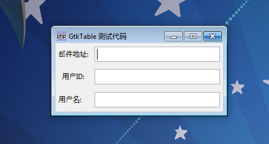

虽然使用 GtkBox 创建动态布局是非常简单的， 但是它非常难做到：不论标签内容多少，等宽的摆放在交互元件的左边。 如果你需要这样的布局，GtkTable 是很好的选择。 元件可以分为若干行和列，并有不同的填充区域。

# 例 1. 表格状布局
~~~
<?php   
if(!class_exists('gtk')){   
	die("php-gtk2 模块未安装 \r\n");   
}   
  
$w = new GtkWindow();   
$w->set_title('GtkTable 测试代码');   
$w->connect_simple('destroy', array('gtk', 'main_quit'));   
  
$lbl1 = new GtkLabel('邮件地址:');   
$lbl2 = new GtkLabel('用户ID:');   
$lbl3 = new GtkLabel('用户名:');   
$align3 = new GtkAlignment(0.0, 0.5, 0, 0);   
$align3->add($lbl3);   
$txt1 = new GtkEntry();   
$txt2 = new GtkEntry();   
$txt3 = new GtkEntry();   
  
$table = new GtkTable(2, 2);   
$table->attach($lbl1 , 0, 1, 0, 1, 0);   
$table->attach($lbl2 , 0, 1, 1, 2, 0);   
$table->attach($align3, 0, 1, 2, 3, Gtk::FILL);   
$table->attach($txt1 , 1, 2, 0, 1);   
$table->attach($txt2 , 1, 2, 1, 2);   
$table->attach($txt3 , 1, 2, 2, 3);   
  
$w->add($table);   
$w->show_all();   
Gtk::main();   
?>
~~~ 

运行例子，你会看到 用户ID 标签当前水平置中。 默认情况下，元件会从两个方向填充到每一个可用的区域，对于多数元件这没有问题。 而对于 GtkLabel 这并不是最理想的：标签应当排列在一边。 set_justify() 函数只能用于多行文本元件中 文本对齐的指定。我们需要用 GtkAlignment 指定标签的文本对齐方式。上面的例子中，标签 用户名 显示了结果。如图：
