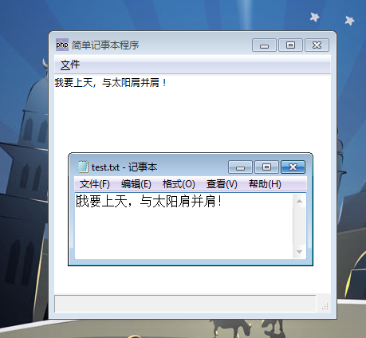

到现在为止，多数强大的 PHP5 面向对象的特色我们都还未用到。 我们将开发一个可以打开文本文件并显示它的内容的程序：一个简单的记事本程序。 需要注意，这是一个非常非常简单的用于指导的应用，并没有实际用途！ 下面是代码，阅读它，并不要被它的尺寸吓倒。代码后面是详细的解释：

# 例 1. 一个简单的记事本程序
~~~
<?php   
if(!class_exists('gtk')){   
    die("php-gtk2 模块未安装 \r\n");   
}   
  
class Notepad extends GtkWindow{   
    protected $currentFile;   
    protected $buffer;   
    protected $status;   
    protected $context;   
    protected $lastid;   
  
    function __construct($fileName = null){   
        parent::__construct();   
                   
        $mainBox  = new GtkVBox();   
        $textBuff = new GtkTextBuffer();   
        $textView = new GtkTextView($textBuff);   
        $statusBar= new GtkStatusBar();   
  
        $mainBox->pack_start($this->buildMenu(), false, false);   
        $mainBox->pack_start($textView, true, true);   
        $mainBox->pack_start($statusBar, false, false);   
  
        $this->currentFile = $fileName;   
        $this->buffer = $textBuff;   
        $this->status = $statusBar;   
  
        $this->connect_simple('destroy', array($this, 'quit'));   
        $this->set_title('简单记事本程序');   
        $this->maximize();   
        $this->add($mainBox);   
        $this->show_all();   
  
        $this->loadFile();   
    }   
  
    function buildMenu(){   
        $menuBar  = new GtkMenuBar();   
        $fileMenu = new GtkMenu();   
        $menuName = new GtkMenuItem('_文件');   
           
        $quit = new GtkImageMenuItem('gtk-quit');   
        $quit->connect_simple('activate', array($this, 'quit'));   
        $quit->connect_simple('enter_notify_event',   
                                array($this, 'updateStatus'), 1);   
        $quit->connect_simple('leave_notify_event',   
                                array($this, 'updateStatus'), 0);   
           
        $fileMenu->append($quit);   
        $menuName->set_submenu($fileMenu);   
        $menuBar->add($menuName);   
  
        return $menuBar;   
    }   
      
    function loadFile(){   
        if($this->currentFile != null) {   
            $contents = file_get_contents($this->currentFile);   
            $this->buffer->set_text($contents);   
        }   
    }   
  
    function updateStatus($enter){   
        if($enter) {   
            $id = $this->status->get_context_id("Message");   
            $lastMsg = $this->status->push($id, "退出应用程序");   
            $this->context = $id;   
            $this->lastid = $lastMsg;   
        } else {   
            $this->status->remove($this->context, $this->lastid);   
        }   
    }   
       
    function quit(){   
        Gtk::main_quit();   
    }   
  
}   
  
new Notepad('test.txt');   
Gtk::main();   
  
?>  
~~~

程序运行结果如下：

# 构造函数

这个类的结构跟之前我们看过的非常类似，除了增加了一些类的属性和方法。 首先来看一看构造函数。这个构造函数有一个可选参数默认为 null。这个参数是我们想要打开的文件的文件名（含路径）。 如果你没有传递参数到构造函数，则不会打开任何内容。

OK，那么我们首先创建父对象（一个 GtkWindow）并创建需要使用的元件。一个 GtkVBox 用于布局，一个 GtkTextBuffer 和一个 GtkTextView 用于显示文件内容，而 GtkStatusBar 用于显示一些消息。设置布局并添加每个元件到 VBox。
~~~
// 设置对象的属性   
$this->currentFile = $fileName;   
$this->buffer = $textBuff;   
$this->status = $statusBar;  
~~~

这三行代码设置类属性的值。类属性是所有使用面向对象的的方法编写的 PHP-GTK 2 程序的重要组成部分。 由于你可能需要在方法中访问那些并不是由这个方法创建的元件，所以特别常用。 当我们创建一个元件，对象的作用域仅在创建它的方法中。 例如，我们在类的构造函数中创建了状态条，但是显然我们需要在其他地方访问它 （当我们需要在上面显示一些信息的时候）。 由于变量 $statusBar 仅能被构造函数内访问， 所以我们赋值给了一个类属性（叫做 status）。 这样我们就可以在这个类的任何方法中使用 $this->status 访问状态条。

简单的扩展这个概念到其他元件上。 基本上，当需要将整个类的范围作为元件的作用域时就需要使用类属性。 事实上，类属性可以用于高效的保存任何你需要在整个类范围使用的数据。 在我们的程序中一个很好的例子就是 currentFile 属性。 这个仅仅存储当前打开的文件路径，没有文件打开时为 null。 我们可以在类的任何方法中获得当前打开的文件的文件名。类属性还有其他的用途， 我现在能想到的一个用于标志。对于我们的记事本程序，你可能想要加入一个叫做 saved 的布尔类型的属性，用来确认当前的文件的内容是否已经写入了硬盘。

需要注意的是，这个类所有的属性都被定义为 protected。 当希望继承的子类可以访问这些属性，而又不可以作为公共变量访问时。 这是一种简单但是非常好的面向对象的实现。

最后，我们设置了标题，并最大化了窗口，添加了布局并显示所有的元件。 同时调用了 loadFile() 方法来显示已经在 text buffer 中创建的文件内容。

# buildMenu() 方法
注意我们如何在构造函数中调用这个方法的：
`$mainBox->pack_start($this->buildMenu(), false, false);  `

这样做的目的是希望能够将我们的类分成若干个模块。 将布局的主要部分提取出来作为一个方法，代替将整个内容放在构造函数中总是更好的办法。 这里使用了一个方法来建立菜单，但是对于创建文本框和状态条来说所以并不需要这么做， 因为创建它们，每一个都只需要两行代码！

在这个方法中，我们只创建了一个菜单条，并添加了只有一个菜单项“Quit”的文件菜单。 让我们看一下这几行：
~~~
$quit->connect_simple('activate', array($this, 'quit'));   
$quit->connect_simple('enter_notify_event', array($this, 'updateStatus'), 1);   
$quit->connect_simple('leave_notify_event', array($this, 'updateStatus'), 0);  
~~~

这里我们连接 activate，enter-notify-event 和 leave-notify-event 到各自的句柄上去。需要留意传递到 connect_simple() 方法的第二个参数。是一个有两个元素的数组。 第一个元素是特殊的 $this 变量，而第二个元素是一个字符串。 如果你已经阅读过 Hello World 指南，你应该已经了解如下的代码：
`$wnd->connect_simple('destroy', array('gtk', 'main_quit'));  `

对比两个应用，你应当已经了解，当希望连接一个信号到一个类中的回调函数时， 必须使用数组来指定这个回调，第一个元素指向类，第二个元素是回调函数的名字。 因此，我们连接退出按钮的事件到 这个（this） 类的 quit() 和 updateStatus() 方法。

有时，为了在类的方法中使用这些对象可能需要传递参数到方法中。一般来说， 如果你有超过两个方法使用了某个对象，那么将这个对象定义为类属性好一些； 但是如果只有一个方法需要这个对象，更好的办法是将这个对象作为参数来传递。 在连接信号和回调函数时经常会遇到这种情况。浏览信号和回调函数的指南了解更多信息， 同时了解如何传递自定义的参数到回调函数。

回到 buildMenu() 方法，返回了 最上层（top-most） 的元件： 菜单条，并已经添加了子菜单在上面。构造函数获得了这个对象并添加到主 VBox 上。

# loadFile() 方法
这个方法的作用是加载打开文件的内容并显示在文本框内。通常来说， 首先应当确定类属性 currentFile 不为空，然后调用 类属性 buffer 的 set_text() 方法。

# updateStatus() 方法
这个方法作为 enter-notify-event 和 leave-notify-event 信号的回调函数。这里我们通过类属性 status 访问状态条，并且当鼠标进入或离开退出菜单项时对其添加或清除信息。

# quit() 方法
这是所有方法中最简单的，仅仅发送了退出 GTK 主循环的信号。 你一定在想为什么创建一个叫做“quit”并只有一行的方法，而不直接连接信号到 main_quit，如下：
`$this->connect_simple('destroy', array('Gtk', 'main_quit'));  `

这样做的原因是在程序中，多数情况需要在程序退出前做一些清理工作， 在这个函数就是做这些清理工作最好的时机。在这个简单的记事本程序中， 可以在此增加检查 saved 标志（再次说明，一个类属性） 并提示用户保存或直接退出。

# 最后两行
~~~
new Notepad('test.txt');   
Gtk::main();  
~~~

实例化一个这个类的对象（同时也打开放在同一个目录下的 test.txt 文件） 并执行 GTK 的主循环。也可以将 Gtk::main() 放置于这个类的构造函数中。