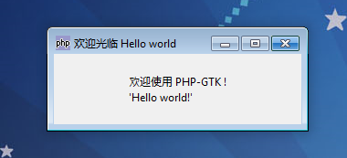

本指南将尝试介绍在 PHP-GTK 2 中使用面向对象编程。PHP 5 对面向对象的支持非常好，因此我们可以在开发 PHP-GTK 2 应用的时候可以使用面向对象的编程方式。

为什么使用面向对象编程非常流行？选择这种编程方式有许多优点， 特别是如果你的程序被分为若干个模块，并且会有成千上万行代码。 一个最重要的优势在于代码结构会更加清晰。 如果使用面向对象的方式编程编写你的程序，你或者其他人阅读和修改这些代码时， 会比使用纯粹的面向过程的编程方式容易许多。

如果你确信面向对象是正确的选择，那么让我们开始吧！

# 基本介绍
我将假设你已经熟悉使用面向对象编程，如果你不熟悉的话， 我建议在阅读本指南之前先了解一下。你应当需要阅读 PHP 5 的手册关于面向对象的章节，这会让你对此有更多的了解。

我们将使用面向对象的方式重新编写简单的“Hello World！”程序， 这样你可以快速掌握要点。首先你必须创建一个类。最简单的方式是从 PHP-GTK 2 已有的类中继承一个你的类。现在，多数程序用 GtkWindow 作为它们最顶级的元件。我们的“Hello World！”程序也是如此。我们将要做的就是 继承（extends）GtkWindow 创建一个类。这让我们的工作容易许多：
~~~
class Hello extends GtkWindow{   
}  
~~~
现在我们需要设计这个类的构造函数（当这个类的对象创建时被调用的函数）。 让我们考虑一下需要在构造函数中做些什么。由于构造函数是类的对象创建时第一个被调用的， 我们必须在其中设置程序的外观。这意味着构造函数创建了所有需要的元件，设置布局（参考 摆放元件） 以及决定我们的应用将是怎样呈现。

现在，从 GtkWindow 继承这个类，但是这并不会自动调用 GtkWindow 的构造函数。这是 PHP5 默认行为，因此我们必须使用关键字 parent 显式调用 GtkWindow 的构造函数：
~~~
class Hello extends GtkWindow{   
    function __construct(){   
        parent::__construct();   
    }   
}  
~~~

这意味着当我们的类 “Hello”的对象创建时，一个 GtkWindow 将会被创建（没有参数被传递到构造函数）。现在问题是如何访问新创建的窗口对象。 关键字 this 会帮助我们完成！ 使用这个关键字可以访问并修改新创建的窗口的所有内容：
~~~
function __construct(){   
    parent::__construct();   
    $this->set_title('欢迎光临 Hello world');   
    $this->connect_simple('destroy', array('gtk', 'main_quit'));   
}  
~~~

由于这是一个非常简单的程序，我们可以仅在构造函数中完成所有的任务。 仅仅将前面面向过程的程序中的代码放到这个构造函数中。这是最终的程序：

# 例 1. Hello World —— 面向对象样式
~~~
<?php   
if(!class_exists('gtk')){   
    die("php-gtk2 模块未安装 \r\n");   
}   
  
class Hello extends GtkWindow{   
    function __construct(){   
        parent::__construct();   
        $this->set_title('欢迎光临 Hello world');   
        $this->connect_simple('destroy', array('gtk', 'main_quit'));   
        $this->connect_simple('destroy',array('gtk', 'main_quit'));   
        $lblHello=new GtkLabel("欢迎使用 PHP-GTK !\r\n'Hello world!'");   
        $this->add($lblHello);   
        $this->show_all();   
    }   
}   
  
new Hello();   
Gtk::main();   
  
?>  
~~~
最后运行我们的程序，跟以前的Hello world程序结果一样，如图所示。

尽管这个例子并不能很全面的演示使用面向对象的方法编程， 但是它总是应该能帮助你有一个开端。我们现在将进一步了解更加高级的概念。