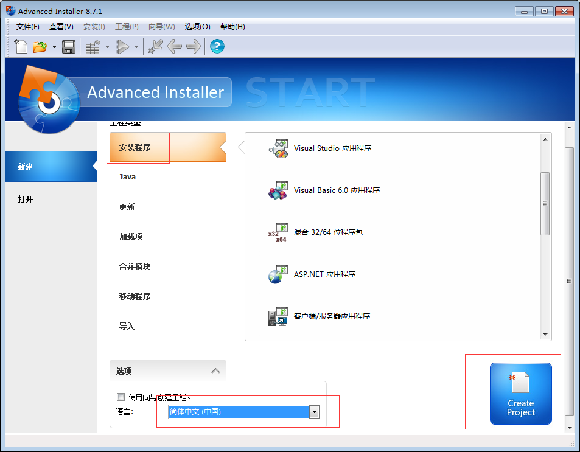
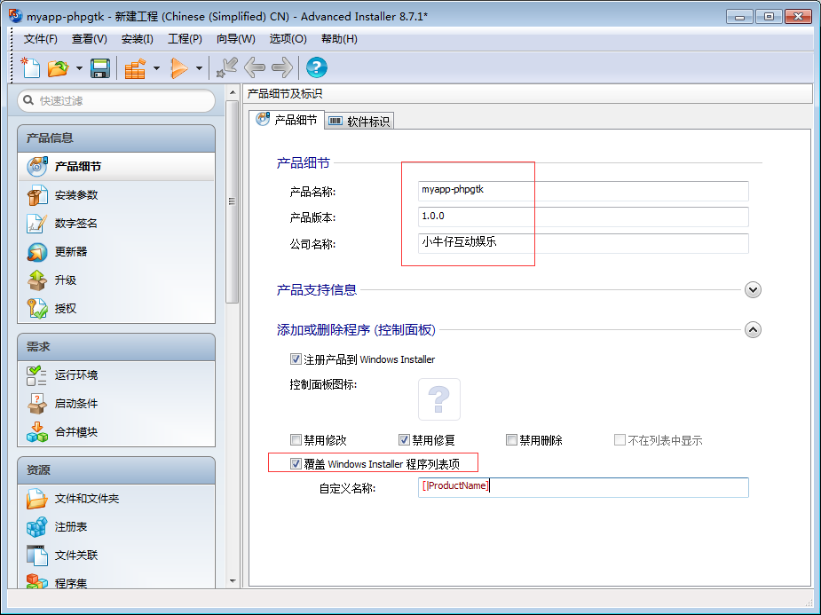
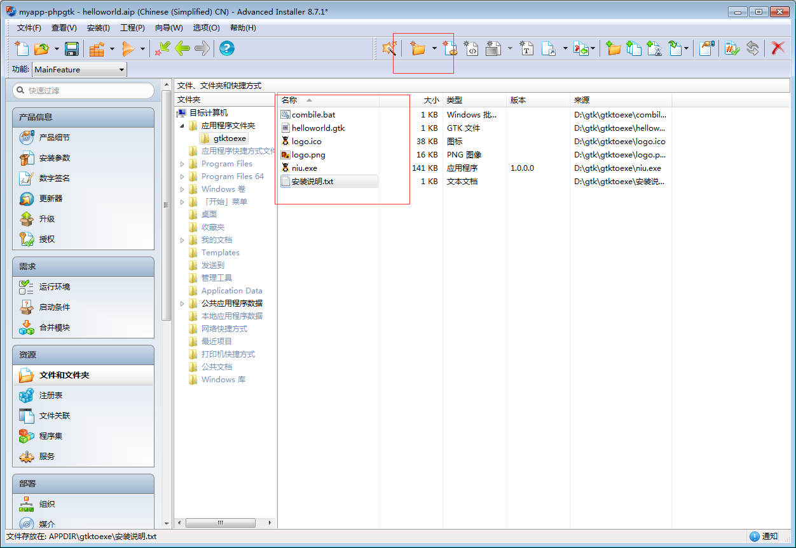
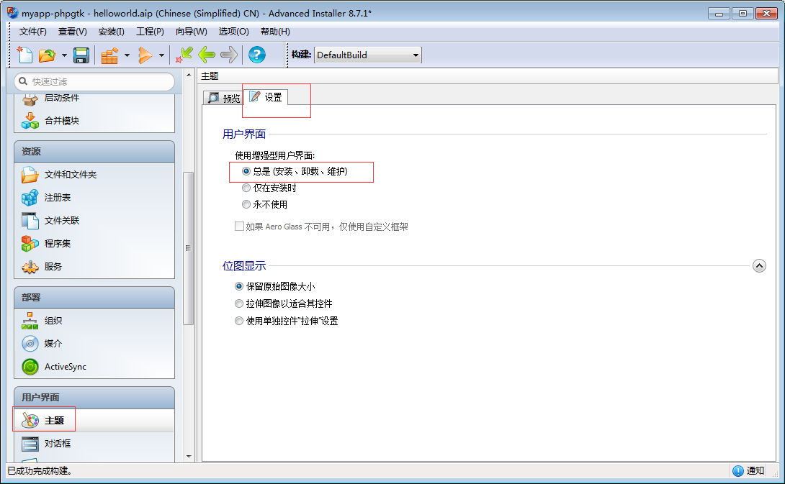
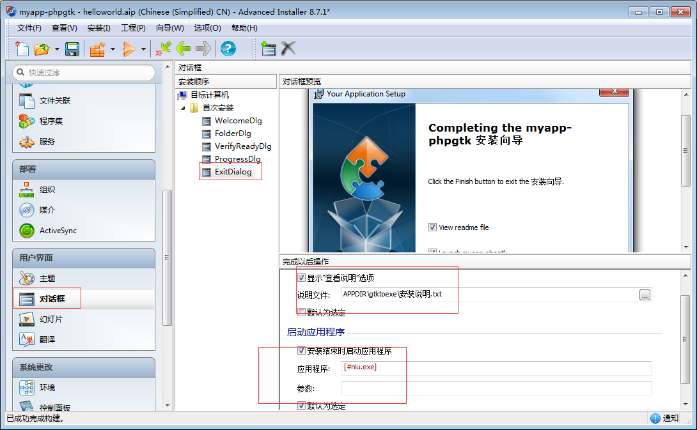
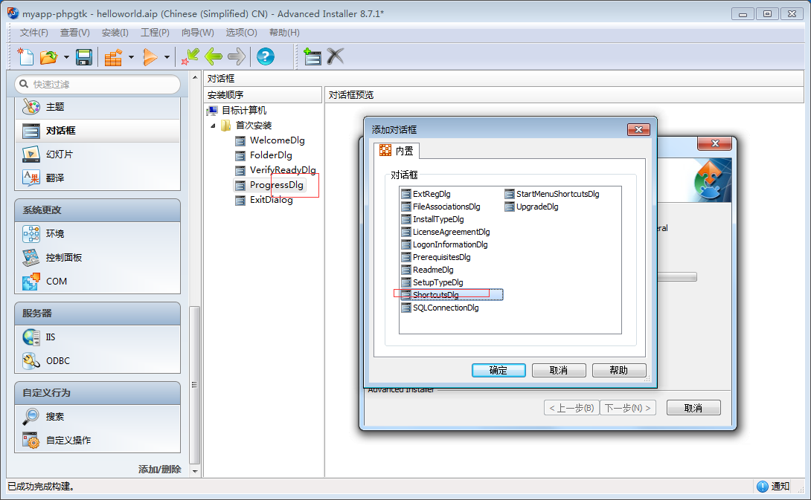
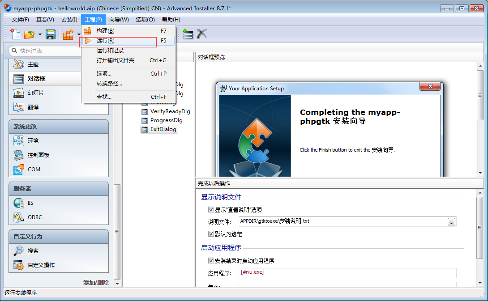
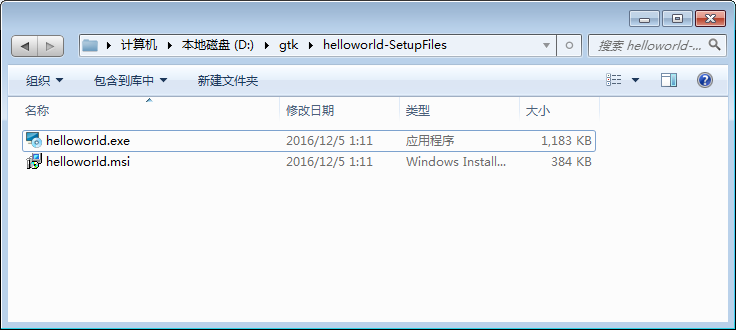
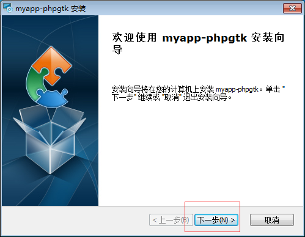
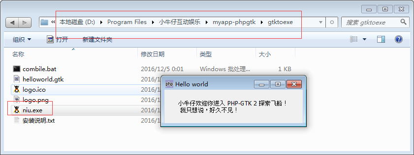

软件开发出来了，当然就是发布出来给用户用，我们这个使用 advanced installer(msi安装包制作工具) 将软件制作安装程序 msi，以便于用户快速的安装使用。

# 1）：安装程序制作工具下载
advanced installer(msi安装包制作工具) v11.0 汉化免费版
http://www.3987.com/xiazai/2/50/275.html

# 2）：开始创建安装程序
点击 Create Project 开始吧。

基本参数设置

文件和文件夹

启用安装向导

执行结束后可以直接运行和加入说明文件

添加加入到桌面快捷方式

运行生成安装程序

生成了我们需要的安装程序，点击任意一个运行

# 3）：将应用程序安装到系统中来
开始安装吧，如此的简单。

# 4）：查看安装目录
这样子就可以OK了，是不是很简单。

教程介绍，例外我们也可以将 PHP-GTK 2 环境打包为安装程序，自动添加 php-win.exe 到 .gtk，自动设置环境变量。当然一般来说，还是没有什么必要的。