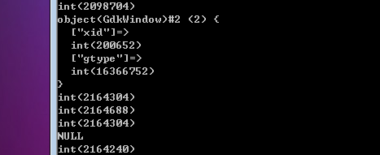
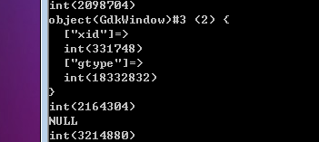

GTK的家族树开始于一个类：GtkObject对象。在GTK家族的每一个类都是扩展GtkObject对象。有些类直接从GtkObject对象扩展，有的则是孙子类。在GTK家族成员基本上可分为两大类：对象和元件。

# GtkObject对象类

GtkObject对象定义了一些基本的方法，并拥有几个信号。有一个基类，不仅对GTK的开发者来说不错，同样对用户也一样。我们知道，我们将有以下几个方法来实例化任何类延伸至GtkObject对象，我们可以在需要的时候调用。

让我们来看看在此对象的类的定义可能看起来一样，如果它被写在PHP中。然后，我们可以谈论它是如何工作和它在我们的开发中扮演何种角色。
~~~
<?php   
class  GtkObject  {   
  
private  $flags;   
private  $refCounter;   
  
public  function  destroy()   
{   
unset($this);   
}   
  
public  function  flags()   
{   
return  $this->flags;   
}   
  
public  function  set_flags($flags)   
{   
$this->flags  =  $this->flags  |  $flags;   
}   
  
public  function  sink()   
{   
if  (--$this->refCounter  <  1)  {   
$this->destroy();   
}   
}   
  
public  function  unset_flags($flags)   
{   
$this->flags  =  $this->flags  &  ~$flags;   
}   
}   
?> 
~~~ 

正如你可以看到的，类中定义少数公共方法。这些公共方法可以被GTK家族中的所有其它类所使用。只是因为他们是可用的，但是，不意味着你会使用它们。很多GtkObject对象定义的方法主要用于PHP-GTK的本身。我们仍然会仔细看一下它们，因为它对于PHP-GTK如何调用它们是非常重要的。

# destroy方法

destroy方法可能是唯一的你在你的代码中明确调用的GtkObject对象的方法。这不正是你所期望的：销毁当前对象。这个方法将被一些继承至GtkObject对象的类所覆盖。

一些类，作为容器，存在只是有逻辑和视觉方面组织它包含的其它对象。只是逻辑和视觉组中的其他对象。当你销毁一个容器，它会销毁它包含的所有对象。例如，销毁你的应用程序的主窗口将会销毁应用程序中的每一个类。

# sink方法

当一个对象不再需要，destroy方法就会被PHP-GTK调用。确定当一个对象不再需要（或者需要）有两种方式来完成。

第一种方式是通过跟踪参考计数器。参考计数器是引用给定对象的对象（包括对象本身）。当引用计数器降为零，它几乎意味着没有人关注对象了。因为没有人关注，PHP-GTK的销毁对象。这种类型的动作是非常罕见的。参考计数器使用sink方法来保持。调用sink方法减少引用计数器。通常情况下，PHP-GTK的应用程序的执行过程中,PHP-GTK总是递增计数器。所以系统没有“unsinking”一个对象的方法。

对PHP-GTK而言，不需要对象的其它方式是，当某人或某事告诉它销毁对象。例如，假设一个A类的实例包含一个B类的实例当你破坏A类的一个实例，你不再需要B类的实例。而A对象是在析构的过程中，它是要告诉PHP-GTK来摆脱B类的实例。另一个例子是，当用户点击窗口右上角的x。告诉你的应用程序，用户使用它完成关闭。在大多数情况下，应用程序将会关闭。它通过销毁主窗口。当主窗口被销毁的时候，它将会销毁它所包含的一切。

# flags, set_flags,和unset_flags方法

flag，set_flags和unset_flags方法正是根据它们的名字表明：分别为返回，设置和删除与对象关联的flags。flags用于跟踪对象的属性，如对象是否是可见的，或者是否可以接受拖放式对象。他们提供了一个简单的方法来跟踪对象，而不使用大量内存。

如果你想知道一个对象的当前状态，可以调用的flags方法和比较一些已知状态的结果。尽管，在实践中，你可能永远都不会使用此方法。同样，你可能不会使用的set_flags或者unset_flags方法。在实际中上，设置flags，并不意味着你已经改变对象的任何属性。设置或取消flags的值可能会混淆您的应用程序。

从另一方面来说，PHP-GTK将使用这些方法。PHP在做任何需要对象在某些状态操作之前，比如说在屏幕上显示对象，它会和当前flags进行比较。如果它们是不正确的，PHP-GTK 将会调用合适的方法将状态调整到正确的状态。例如，一个按钮在屏幕上显示前，必须在一个窗口中。 PHP-GTK的使用flags方法来快速检查，如果按钮是蓄势待发。任何改变对象状态的方法，将根据需要调用set_flags或者unset_flags。传递到set_flags和unset_flags的参数是一个整数，它用来通过位运算的改变对象的flags值。对PHP-GTK将调用set_flags当你要显示或者实现一个对象，PHP-GTK将会调用set_flags。如果后来你将要隐藏该对象的时候，PHP-GTK将会调用unset_flags。在PHP-GTK做这些任何操作之前，它会调用flags方法来检查flags来确保是否需要做这些工作。

对象flags将允许PHP-GTK来快速和轻松地管理对象的属性。这几简单的方法是不可或缺的，能够控制和操纵所有从GtkObject对象继承来的类。

# 对象

对象是类直接从GtkObject对象和它们的孩子继承而来的，除了GtkWidget类和它的继承类。

对象通常被认为是辅助类。它们没有任何可视化组件可以显示在屏幕上。控制和操作文本的缓冲区是一个对象的例子。

对象不能直接地与用户交互。因为它们没有可视化组件，用户不能够选择或者点击。

对象通常用于存储数据，如数量范围或者文本。它们被用来封装数据和操纵这些数据提供了一个一致的界面。捆绑一个数字比几个数字，同时努力保持它们有条不紊容易得多。

# 元件

元件是继承至GtkWidget（GtkObject的对象继承类）的类。元件是技术上的对象，因为它们是从GtkObject对象继承而来的，但它们在GTK的世界里应得到特殊待遇。

元件是具有视觉表现的对象，并可以响应用户输入。元件是你是通过GUI应用程序中使用的熟悉的类。按钮是一个元件，同时标签，菜单和窗口也都是元件。 元件是对象与应用程序的用户直接打交道的对象。它们可以接受交互活动，如用户点击，缩放，甚至拖放。

元件是可以显示或者隐藏的。他们可以给键盘焦点或者失去焦点。你还可以控制单个元件或者某一类型的所有元件的外观和手感。元件和对象彼此需要对方，来使应用程序工作起来。数据不能够看到或者交互是很没有用的。一个按钮如果没有一个标签或者不能够更改任何数据将是非常不好的。元件和对象必须共同努力，让应用变得非常成功。

元件作为视觉对象，可以显示在屏幕上。这并不总按你想的，虽然，这不是它们如何开始。

例如，你可能不希望显示按钮直到用户输入文本域中的某些数据。你不必显示按钮，直到你
准备好了。为了帮助你管理显示什么或者隐藏什么，元件有三种基本状态：realized（实现）,unrealized（未实现）和shown（显示）。这三个状态代表一个元件的视觉状态，我们将在这里仔细讨论这里。

> 注意：为混乱的命名约定而道歉。这是事实，所有的元件件都是对象，但它们是一个对象的特殊和相当大的子集。请记住，当我指PHP-GTK的对象时候，意味着这些类都是不继承的GtkWidget的。

# Realized（实现）状态

实现元件是一个具有有效的窗口和分配属性的元件。这是屏幕上尚未可见的，但它是准备要显示的。窗口属性的元件是一个GdkWindow的实例。记住，GDK类是那些真正关注的展现在屏幕上的视觉元素。

分配的属性，为GdkAllocation类的一个实例，拥有元件的位置和尺寸。它的值为X和Y坐标，元件的高度和宽度。窗口和分配的属性负责告诉PHP-GTK如何将被显示元件。实现状态也可能被称为隐藏状态。这是因为它和显示状态的元件非常相似，但它只是不显示在屏幕上。只有实现的元件才可以显示。幸运的是，足够聪明的GtkWidget基类是在内部实现一个元件，在你尝试显示它之前。

下面是改变状态的列子：
~~~
<?php          
if(!class_exists('gtk')){      
    die("php-gtk2 模块未安装 \r\n");   
}      
    
$widget  =  new  GtkWindow();   
  
// 在窗口还没有实现之前，Window是空的   
var_dump($widget->window);   
var_dump($widget->flags());   
  
$widget->realize();   
  
// 这里已经实现了，现在可以获取到了   
var_dump($widget->window);   
var_dump($widget->flags());   
  
$widget->show();   
  
var_dump($widget->flags());   
  
$widget->hide();   
  
var_dump($widget->flags());   
  
$widget->unrealize();   
  
var_dump($widget->window);   
var_dump($widget->flags());   
?>  
~~~

运行结果如下：

适当命名的一些方法可以帮助你改变一个元件的状态。实现方法告诉PHP-GTK的给元件分配内存空间，因为你打算很快显示它。如果你调用元件的realize方法，元件将会被切换到realized（实现）状态，但是被隐藏着。也就是说，PHP-GTK将分配给它一个的有效的GdkWindow和GdkAllocation。尽管如此，元件将不会显示在屏幕上。

刚才我们谈到元件如何可能是其它元件的成员，以及销毁方法如何可以影响这些成员。realize方法同样将会对元件比调用的元件产生深的影响。一个元件无法到实现状态，直到它的父元件为实现状态。

你如果从逻辑上将，这是相当不错的原因。实现一个元件将会告诉你它会在屏幕上。但是，如果你不知道它的父元件在什么地方，你怎么能够知道它在什么地方呢？如果您尝试实现一个元件，而其父元件尚未实现，PHP-GTK将会帮助你将父元件也实现了。它会做一个递归，一路到顶级的元件，这通常是一个窗口。

在大多数应用中，realize实现方法不需要直接调用。唯一的例外，在一个元件在显示之前，当你需要知道它将在屏幕上或者将需要多大的空间。例如，想想看如下的情形，你想将打印的图像的尺寸作为窗口的标题。在图像显示在屏幕之前，你可以通过调用realize实现方法来获取它的大小和位置，然后检查分配给它的属性值。

# Unrealized（未实现）状态

当你第一次创建一个元件，它处于为实现的状态。未实现的状态意味着一直没有内存分配给元件的视觉部分。未实现的元件不会有大小，它也没有一个位置。最重要的是要了解未实现的元件是它没有一个有效的窗口属性值。正如在前面的例子中打印图像的尺寸为窗口的标题，你不能从一个为实现的对象获取图像的尺寸。

正好有一个realize方法，有一个unrealize方法。 调用unrealize方法删除元件的窗口和分配的属性。如果一个元件当前是显示的，当调用unrealize方法的时候，元件首先被隐藏，然后是未实现状态。

就像realize方法一样，unrealize方法同样将会对元件比调用的元件产生深的影响。如果是未实现元件有子元件，这些子元件也将未实现的。 定位和大小信息不再相关，如果父元件不包含任何位置和尺寸的信息，那么子元件也不会包含位置和尺寸的信息。但是，反过来这些规则是不成立的。实现一个父元件不会实现其子元件，就像未实现子元件并不意味着未实现父元件。

下面就是一个列子：
~~~
<?php          
if(!class_exists('gtk')){      
    die("php-gtk2 模块未安装 \r\n"); 
}      
    
$window  =  new  GtkWindow();   
var_dump($window->window);   
var_dump($window->flags());   
  
$button  =  new  GtkButton();   
$window->add($button);   
  
$button->realize();   
var_dump($window->window);   
var_dump($window->flags());   
  
$window->unrealize();   
var_dump($button->window);   
var_dump($button->flags());   
?>
~~~  

运行结果如下：

 
首先，我们在窗口最初的未实现状态显示窗口。然后，添加一个按钮，实现按钮，我们再次检查窗口的状态。窗口的属性已经明确地显示出来了，意味着窗口已经实现了，尽管这里我们没有为窗口调用realize方法，因为子元素的实现递归到顶层让顶层也实现了。下一步，我们在实现状态的按钮，然后unrealize窗口。这个时候我们尝试再次查看按钮的窗口属性，它已经一去不复返了。

# Shown（显示）状态

为了达到显示状态，所有你需要做的是调用元件的show方法。如果元件尚未实现，PHP-GTK首先会实现该元件。

当你不再需要显示元件，你可以调用hide方法。这将移动元件为实现或者隐藏状态。该元件将仍然有它的窗口和分配属性，但不会被显示在屏幕上。

显示或者隐藏一个元件和一个元件的实现（realize）的递归效果是完全不一样的。如果你显示一个元件，而它的父元件并未显示，这看起来似乎什么都没有发生过。父元件没有实现，它的孩子也同样不会实现。当父元件准备好了后，PHP-GTK将会排列这些请求和显示这些元件。

试着改变上边的实现（realize）方法的代码来显示。你会看到窗口对象的属性仍然是空的。如果你改变unrealize来调用show显示，将看到的窗口和按钮的窗口属性都是对象。也可以尝试显示不显示按钮的窗口。这将证明，显示元件并不是递归的。按钮将不会显示，除非你明确调用显示按钮，那就是，除非使用show_all方法。

show_all方法显示调用的元件，然后递归地显示所有元件的子元件。根据show_all放来来推论hide_all方法。调用hide_all会隐藏主元件和递归隐藏其子元件。记住，hide和hide_all只是移动元件为实现状态。它们不是为实现状态元件。 元件仍然有它的窗口和分配属性。