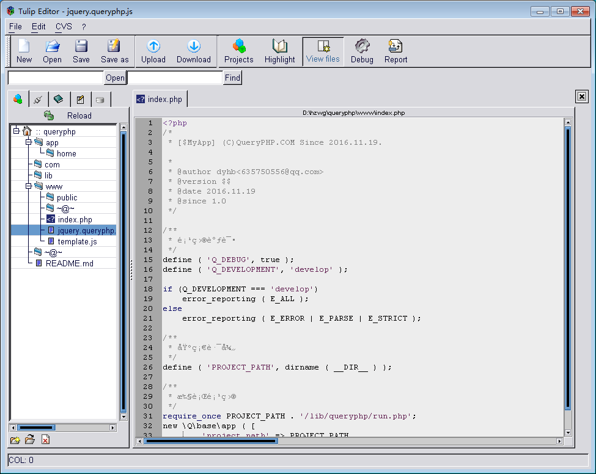

PHP-GTK是为了证明PHP是一种远远超越网络应用程序的有效的工具而开发的。

# Tulip Editor

> Tulip Editor，一款采用 PHP-GTK 1 开发的编辑器软件，大家可以通过 bing.com 搜索下载。

# 关于本书
本于由 **刘祥敏** 制作，大家有什么意见和建议欢迎联系。

> 说明：本书基于 PHP-GTK 2 英文文档，结构做了非常清晰地调整，图文并茂帮助你快速领悟到真理。