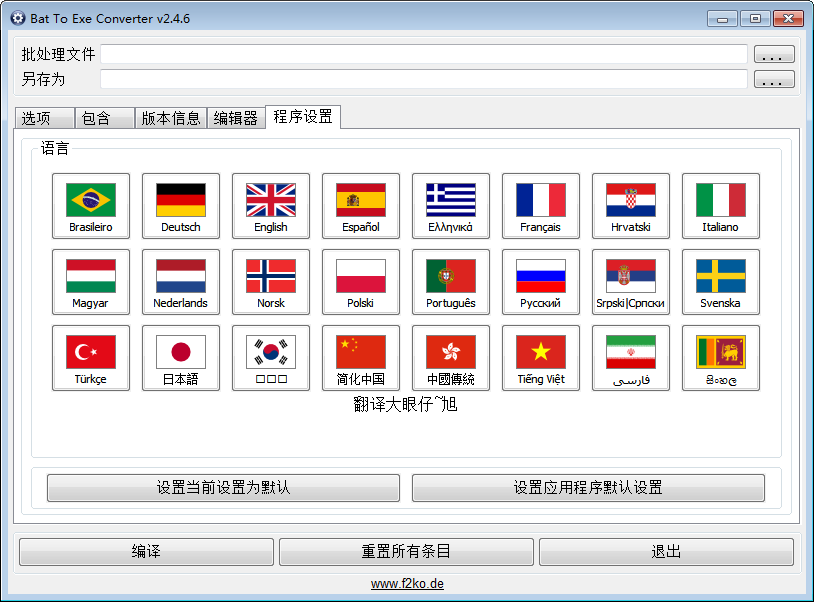
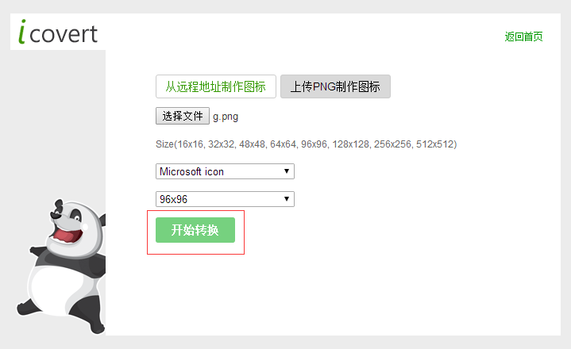
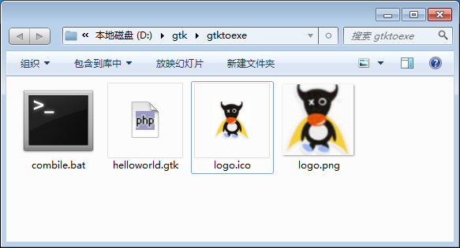
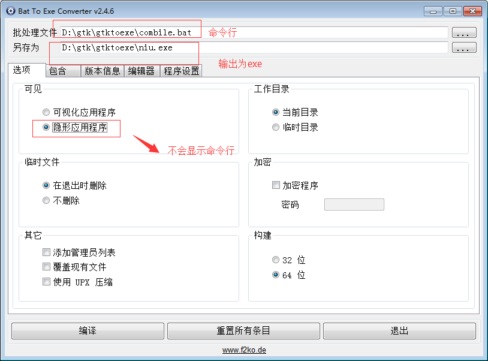
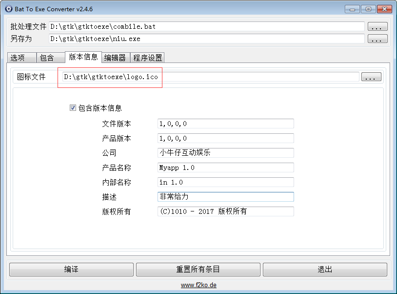
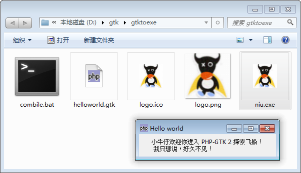

手动将 .gtk 关联到 php-win.exe 有点怪异，那能不能打包为 exe 直接运行呢，答案是肯定的。
我们使用命令行可以直接运行 .gtk 的程序，我们写一个 bat 程序运行 .gtk，然后使用 **bat转exe工具** 将这个 bat 转化为 exe 就可以了。

#1）下载打包工具
Bat To Exe Converter 2.4.6免费汉化版，该软件能够将命令行打包为 exe 可执行文件，安装好改程序。
http://www.pc6.com/softview/SoftView_31106.html

#2）准备材料
新建一个 D:\gtk\gtktoexe 目录做为准备，一张 logo.png 图片，一个命令行文件 combile.bat, 一个 gtk 程序。
将 logo.png 转 icon 备用，在线转化地址 http://www.easyicon.net/covert/

combile.bat 代码如下：
~~~
@echo off

if "%b2eprogramfilename%"==""  (

	echo 想要查看结果请使用 BatToExeConverter 软件打包
	pause
	goto :eof

)

php-win.exe helloworld.gtk
~~~

helloworld.gtk 代码如下：
~~~
<?php

if (!class_exists('gtk')) {
    die("php-gtk2 模块未安装 \r\n");
}

try{
	$wnd = new GtkWindow();
	$wnd->set_title('Hello world');
	$wnd->connect_simple('destroy', array('gtk', 'main_quit'));
	 
	$lblHello = new GtkLabel("小牛仔欢迎你进入 PHP-GTK 2 探索飞船！\r\n 我只想说，好久不见！");
	$wnd->add($lblHello);
	 
	$wnd->show_all();
} 
catch(Exception $e) { 
	
}
 
Gtk::main();

?>
~~~

#3）执行打包
万事俱备，只欠东风，开始啦！

### （1）：基本配置

### （2）：设自图标版权

### （3）：打包完成，点击运行 niu.exe
熟悉的 helloworld 出现在你的面前。
