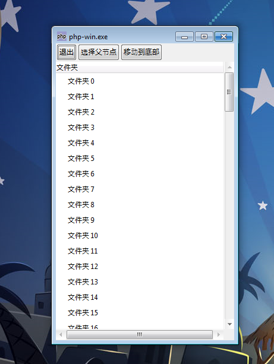
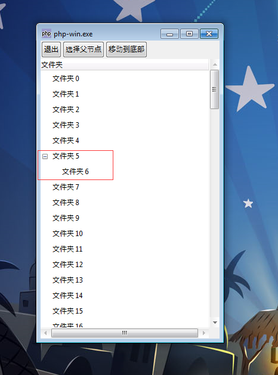

GtkTreeView元件在Model/View/Controller的设计方法中起到视图View的角色。它关心的是显示模型Model（GtkTreeStore和GtkListStore）中的数据给用户。一个模型Model可以拥有多个视图，而且改变一个模型后会立刻展现在视图中。

为了使用GtkTreeView，你需要去创建元件本身，然后使用GtkTreeViewColumns创建显示的列和使用GtkCellRenderers去告诉列怎样在其中展示单元格。

# 例 1 . TreeView和Renderer
~~~
$view = new GtkTreeView($model);   
$renderer = new GtkCellRendererText();   
$column = new GtkTreeViewColumn("Folder", $renderer, "text", 1);   
$view->append_column($column);  
~~~
这段代码创建的一个新的GtkTreeView，然后将它附属在模型上。接着我们创建一个text单元格renderer和一个列，然后将这些添加至视图。

在Gtk+的元件库中有一些GtkCellRenderers，如果它们不够，你还可以编写自己的。

在一个GtkTreeView(view)中用户的选择可以跟踪到使用GtkTreeSelection对象。当用户改变了选择而你又的代码又需要声明，你可以连接到GtkTreeSelection中的“changed”信号。你还可以让选择对象的每一个选中的节点绑定一个函数，或者改变你的选择对象。

# 例 2. 选择变化信号
~~~
$selection = $view->get_selection();   
$selection->connect("changed", "display_selected_folder");  
~~~
这些代码连接“changed”信号到一个函数（display_selected_folder()）展示选中文件夹的内容。

你需要使用drag-and-drop明确地告诉GtkTreeView用户可以让文件夹可以拖动排序。幸运的是，一旦你做了这些后，元件本身会自动维护剩下的。

# 例 3. Drag-and-Drop 拖动排序
~~~
$view->set_reorderable(true);
~~~

上面就是让元件可以处于可以拖动排序状态。

同理，当你需要将一个子节点从树中移出来，然后插入到后面作为另一个节点的子节点，这个时候你需要改变手动设置，这个时候元件不能够自动拖动排序（drag-and-drop）。

# 例 4. 手动排序
~~~
$folder = $model->get_value($old_iter, 0);   
$model->remove($old_iter);   
$new_iter = $model->insert_before($new_parent, null);   
$model->set($new_iter, 0, $folder);   
$model->set($new_iter, 1, $folder['name']);  
~~~

这段代码从old_iter移除一个节点使它成为新的父节点的最后一个子节点。

# 例 5. 示例的源代码
~~~
<?php   
if(!class_exists('gtk')){   
	die("php-gtk2 模块未安装 \r\n");   
}   
  
$view = null;   
$choose_parent_view = null;   
$dialog = null;   
  
function move($old_iter = null, $new_parent, $model){   
      if ($old_iter) {   
              $folder = $model->get_value($old_iter, 0);   
              $model->remove($old_iter);   
              $new_iter = $model->insert_before($new_parent, null);   
              $model->set($new_iter, 0, $folder);   
              $model->set($new_iter, 1, $folder['name']);   
      }   
}   
  
function dialog_ok($args){   
		global $dialog, $choose_parent_view, $view;   
  
		$dialog->hide();   
  
        list($model, $parent_iter) = $choose_parent_view->get_selection()->get_selected();   
        list($model, $old_iter) = $view->get_selection()->get_selected();   
  
        if ($parent_iter && $old_iter) {   
        		move($old_iter, $parent_iter, $model);   
        }   
}   
  
function dialog_cancel($args){   
      global $dialog;   

      $dialog->hide();   
}   
  
function choose_parent($args){   
      global $dialog;   

      $dialog->show();   
}   
  
function move_to_bottom($args){   
      global $view;   

      list ($model, $old_iter) = $view->get_selection()->get_selected();   
  
      if ($old_iter) {   
      move($old_iter, null, $model);   
      }   
}   
  
function quit($args){   
      Gtk::main_quit();   
}   
  
function make_view($model){   
        $view = new GtkTreeView($model);   
        $view->set_reorderable(true);   
        $renderer = new GtkCellRendererText();   
        $column = new GtkTreeViewColumn("文件夹", $renderer, "text", 1);   
        $view->append_column($column);   
        $view->show();   

        $scrolled = new GtkScrolledWindow();   
        $scrolled->add($view);   
        $scrolled->show();   

        return array($view, $scrolled);   
}   
  
function make_buttons($list){   
        $buttonbox = new GtkHBox();   

        foreach ($list as $label => $func) {   
                $button = new GtkButton();   
                $button->set_label($label);   
                $button->connect("clicked", $func);   
                $button->show();   
                $buttonbox->pack_start($button, false, false);   
        }   

        $buttonbox->show();   

        return $buttonbox;   
}   
  
$model = new GtkTreeStore(GObject::TYPE_PHP_VALUE,GObject::TYPE_STRING);   
  
for ($i=0; $i < 100; $i++){   
        $folder = array('name' => '文件夹 ' . $i, 'files' => array('foo', 'bar'));   
        $iter = $model->insert_before(null, null);   
        $model->set($iter, 0, $folder);   
        $model->set($iter, 1, $folder['name']);   
}   
  
list($view, $scrolled) = make_view($model);   
$view->set_reorderable(true);   
  
$buttons = array(   
      "退出" => "quit",   
      "选择父节点" => "choose_parent",   
      "移动到底部" => "move_to_bottom"  
);   
  
$buttonbox = make_buttons($buttons);   
  
$vbox = new GtkVBox();   
$vbox->pack_start($buttonbox, false, false);   
$vbox->pack_start($scrolled, true, true);   
$vbox->show();   
  
$win = new GtkWindow(Gtk::WINDOW_TOPLEVEL);   
$win->connect("delete_event", "quit");   
$win->add($vbox);   
$win->show();   
$win->resize(300, 500);   
  
list($choose_parent_view, $scrolled) = make_view($model);   
  
$buttons = array(   
    "确定" => "dialog_ok",   
    "取消" => "dialog_cancel"  
);   
  
$buttonbox = make_buttons($buttons);   
  
$vbox = new GtkVBox();   
$vbox->pack_start($scrolled, true, true);   
$vbox->pack_start($buttonbox, false, false);   
$vbox->show();   
  
$dialog = new GtkWindow(Gtk::WINDOW_TOPLEVEL);   
$dialog->set_default_size(200, 400);   
$dialog->add($vbox);   
  
Gtk::main();   
  
?>  
~~~
运行效果如下，初始化后的截图如下：

排序过程中，你除了点击确定，还可以像QQ拖好友到分组一样，选择一个文件夹（节点）拖到另一个节点中去，这个时候另一个节点从了父节点，你选中就成为了的它的子节点，这就是上面的拖动排序,我们这里将文件夹 6拖到文件夹 5中。

排序后效果如下：
