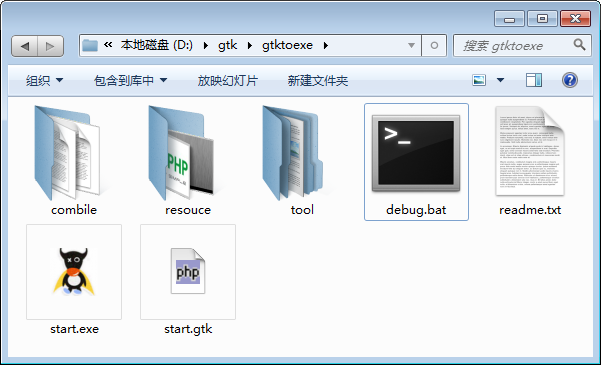
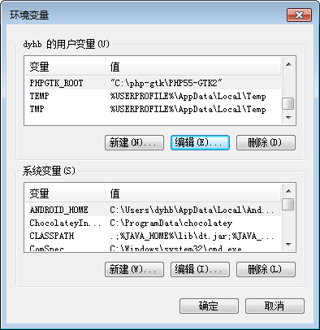
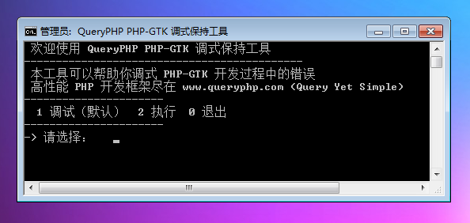
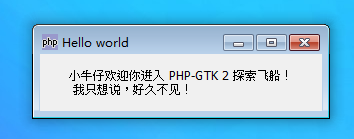
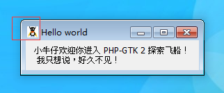

为了更好地开发 PHP-GTK 应用，我们这里为大家提供了一个简单的调试工具。

# 典型的调试系统 APP 结构如下

| 项目   |  说明  |
| --- | --- |
|  start.gtk   |  真正的PHP-GTK 应用入口  |
|  start.exe   |  exe 式入口   |
|  debug.bat  |  调试工具  |
|  combile   |  编译需要的工具，网上可以下载  |

# 设置环境变量 PHPGTK_ROOT 
上边我们设置过 path 环境变量，如果我们使用现在调试工具，就不用设置path 环境变量，而是设置一个 PHPGTK_ROOT环境变量，路径为 PHPGTK 存放目录，我们系统会通过这个路径去调用php 来处理程序。

# 调试工具 debug.bat 
这里就用到了 PHPGTK_ROOT 这个环境变量了。
~~~
@echo off

prompt -$g  
title QueryPHP PHP-GTK 调式保持工具 

if not exist %PHPGTK_ROOT% (
        echo  PHPGTK 未安装或者PHPGTK_ROOT 环境变量未设置
        pause
        goto :eof
)

if not exist %PHPGTK_ROOT%\run.exe (
        if not exist  %cd%\combile\source\run.exe (
              echo  当前执行文件 %cd%\source\run.exe 不存在，请确认
              pause
              goto :eof
        )
        copy  %cd%\resource\run.exe %PHPGTK_ROOT%
        echo  run.exe 自定义图标的执行文件复制成功
)

goto menu   
  
:menu   
echo ^ 欢迎使用 QueryPHP PHP-GTK 调式保持工具   
echo ^--------------------------------------------   
echo ^ 本工具可以帮助你调式 PHP-GTK 开发过程中的错误
echo ^ 高性能 PHP 开发框架尽在 www.queryphp.com (Query Yet Simple)
echo ^----------------------   
echo ^  1 调试（默认）  2 执行  0 退出   
echo ^----------------------   
set /p input=-^> 请选择：   
echo.   
if "%input%"== "0" goto end  
if "%input%"== "1" goto debug   
if "%input%"== "2" goto run 
if "%input%"== "" goto debug   
goto end  
  
:debug   
%PHPGTK_ROOT%\php.exe start.gtk
echo ^上面为 PHP-GTK 调式的信息   
echo ^----------------------   
echo ^  1 调试（默认）  2 执行  0 退出          
echo ^----------------------   
set /p input=-^>请选择 :   
if "%input%"=="0" goto end  
if "%input%"=="1" goto debug   
if "%input%"=="2" goto run   
if "%input%"=="" goto debug   
goto end  

:run   
%PHPGTK_ROOT%\run.exe start.gtk
echo ^----------------------   
echo ^  1 调试（默认）  2 执行  0 退出          
echo ^----------------------   
set /p nSelect=-^>请选择 :   
if "%input%"=="0" goto end  
if "%input%"=="1" goto debug   
if "%input%"=="2" goto run 
if "%input%"=="" goto debug   
goto end  
  
:end  
prompt   
popd
~~~

# 入口文件 start.gtk
这里就用到了 PHPGTK_ROOT 这个环境变量了，PHP-GTK 应用中通过 $_SERVER['PHPGTK_ROOT'] 来获取路径。
~~~
<?php   
if(!class_exists('gtk') || !isset($_SERVER['PHPGTK_ROOT'])){   
    die("php-gtk2 模块未安装或者环境变量 PHPGTK_ROOT 未设置 \r\n"); 
}   
  
try{
    $wnd = new GtkWindow();
    $wnd->set_title('Hello world');
    $wnd->connect_simple('destroy', array('gtk', 'main_quit'));

    $lblHello = new GtkLabel("小牛仔欢迎你进入 PHP-GTK 2 探索飞船！\r\n 我只想说，好久不见！");
    $wnd->add($lblHello);

    $wnd->show_all();
} 
catch(Exception $e) { 

}

Gtk::main();
~~~

# 修改自定义图标 combile/combile.bat
如果你需要修改自定义图标，使用软件 ResHacker 3.5 修改 php-win.exe 文件为 run.exe，拷贝到安装目录，我们这里程序会自动拷贝文件过去。
~~~
@echo off

if not exist %PHPGTK_ROOT% (
        echo  PHPGTK 未安装或者PHPGTK_ROOT 环境变量未设置
        pause
        goto :eof
)

if not exist %PHPGTK_ROOT%\run.exe (
        if not exist  %cd%\combile\source\run.exe (
              echo  当前执行文件 %cd%\source\run.exe 不存在，请确认
              pause
              goto :eof
        )
        copy  %cd%\resource\run.exe %PHPGTK_ROOT%
        echo  run.exe 自定义图标的执行文件复制成功
)

if "%b2eprogramfilename%"==""  (
	echo 想要查看结果请使用 BatToExeConverter 软件打包
	pause
	goto :eof
)

run.exe start.gtk
~~~

# 总结
这里为大家提供了调试工具，还可以自定义图标，非常给力是不是。